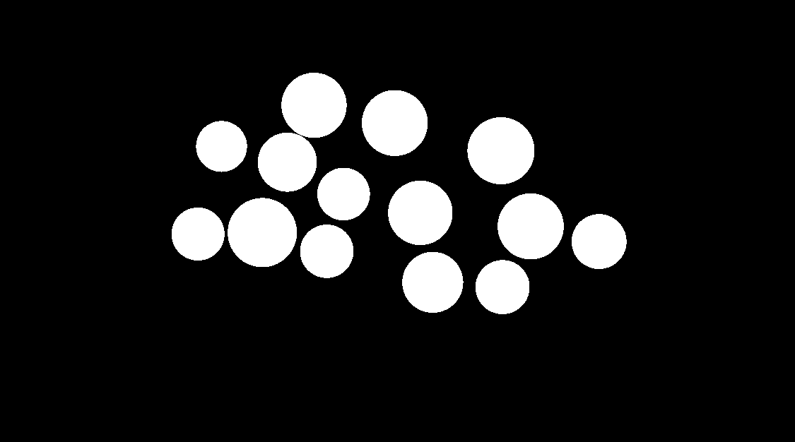
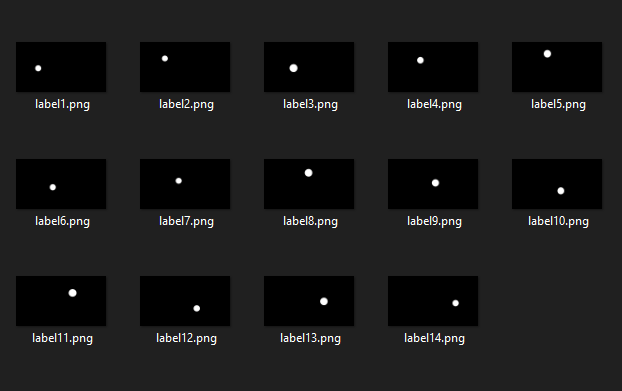

# Image-Processing-
University Project - implementation of several Image Transformations.
CLR application in .NET framework. Using System::Drawing namespace. 

### Standard Deviation Filtration
new value of every pixel is standard deviation of its neibourhood (size of mask)

result with mask of size 3: 

                        

### Labeling Image
dividing objects on image by labelling connected pixels using recursion

### Closing Image 
use of erosion and dilation, creating structural element

                       

### Affine Transformations

implementation of scaling, rotation, shear,translate and affine by transformation matrix

